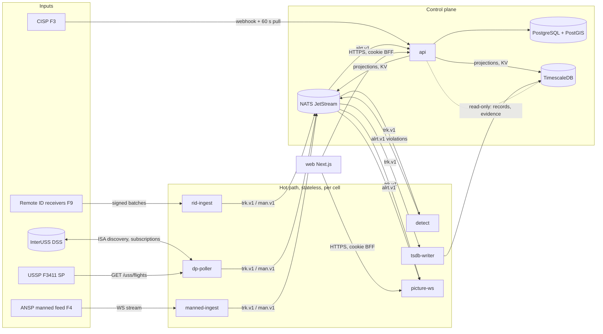

# uspace-authority implementation plan

Status: plan for implementation by independent agents, one work package
per pull request. Branch `plan/initial`. Inputs: the spec at
`uspace-lab/docs/spec/` (`00` overview and technology, `01 §1` the
authority's obligations, `02` flows F1, F3, F4, F7, F8, F9, F10, F11 and the
authority's endpoint groups in `§3`, `03 §1` the data model, `04` messages,
`05` scale, `06` security, `07` phase 3 milestones A-M1..A-M5, `08` open
questions, `09` conformance), the knowledge base at `uspace-lab/knowledge/`
(`LESSONS.md`, 18 vector files, `scenarios.md`), the shared library
`rootxkit/uspace-core` (`v0.2.0`; `docs/PLAN.md` there is the template for
this plan) and the predecessor `rootxkit/utm` at `484cd22` (read-only
reference for behaviour, never for architecture).

Sections: 1 scope and role boundary; 2 architecture; 3 package layout;
4 data model and migrations; 5 the published API; 6 bus subjects and
projections; 7 security; 8 performance budgets; 9 testing strategy;
10 deployment; 11 milestones; 12 work packages, waves and the dependency
graph; 13 engineering standards and CI; 14 open questions with proposed
answers.

---

## 1. Scope and role boundary

`uspace-authority` is the competent authority's system (GCAA; the name,
logo and contact are configuration, spec `06 §4`). It is the source of
truth for the registry of UAS operators, UAS and remote pilots, the
geo-zones and U-space airspace designations, the USSP and CISP
certificates and public register, the Remote ID receiver fleet and its raw
observations, violations found from the authority's own evidence,
incidents and evidence packs, occurrence reports under Reg. 376/2014, the
audit log of every oversight act, and the ecosystem OAuth2 token issuer
(spec `01 §1`, `03 §1`, `09 §2`). It is a standard ASTM F3411-22a Display
Provider for the network identification that USSPs serve (`02 F7`).

### 1.1 What this system does NOT do

| Not here | Where it is | Source |
|---|---|---|
| Alert remote pilots or operators in real time, separate traffic, issue resolution advice or proximity (CPA) warnings to anyone | USSP (Art. 11, 13) | `01 §1` MUST NOT; `01 §7` |
| Command, configure or geofence an aircraft; hold any credential, socket or protocol that reaches a flight controller | nowhere, ever | `00 §1`, LESSONS INV-01 |
| Issue per-flight flight authorisations or deconflict intents | USSP (Art. 10) | `01 §1` MUST NOT |
| Publish the common information picture (ED-318 reads, change feed, webhooks) | CISP; this system *publishes to* it (F1) and *subscribes* like any client (F3) | `01 §2` |
| Author dynamic restrictions | ANSP; this system reads them from the CIS and may *request* one (F11) | `01 §4` |
| Serve network identification (F3411 Service Provider, ISAs) | USSP; this system is a Display Provider only | `02 F7` |
| Keep Display Provider data beyond 24 h | disposed of within `NetDpMaxDataRetentionPeriodSeconds`; oversight history comes from USSP records (F7) and from what a violation copied at detection | `01 §1` MUST NOT; `05 §4` |
| Release operator PII to USSPs, police without purpose, public pages or exports | status-only validity answers; purpose-logged police realm; redacted evidence packs | `06 §2` T6, `06 §5` |
| Turn an occurrence report into a violation, or join the two | violations rest on the authority's own evidence; no foreign key, no query path, between the two | 376 Art. 15–16; `03 §1` |
| Assume the USSP is `uspace-ussp` | USSPs are discovered through the DSS and the CIS USSP list; every USSP-facing interface is F3411 or a published national OpenAPI contract | `00 §7` |
| Business logic in the web UI | `web/` renders what `api` and `picture-ws` say; its API routes are a cookie-exchange BFF only | `00 §6.2`, `06` T12 |

### 1.2 Decisions taken in this plan

Each is justified where it is used; deviations from the spec are also
listed in §14.

| # | Decision | Why |
|---|---|---|
| D1 | Seven Go processes, exactly the spec's list (`00 §6.1`): `api`, `rid-ingest`, `dp-poller`, `manned-ingest`, `detect`, `tsdb-writer`, `picture-ws`. Periodic jobs (certificate lapse, registry re-projection, retention, hash-chain verification) run inside `api` under PostgreSQL advisory locks, so several `api` replicas never run one job twice; no eighth process. | One image, seven entrypoints; the droplet has 2 vCPU (`§10`); a job process would be a singleton the spec does not name. |
| D2 | Projections for the hot path live in **two places**, both named by spec `05 §2`: small, latency-critical state (source switches, policy, cell ownership) in NATS KV with a push subject; large state (registry facts, zones and U-space airspaces, the CIS cache of restrictions) in **projection tables in the telemetry database**, written by `api`, announced by a push subject and re-read periodically. Hot-path processes open the telemetry database read-only and never the relational one. | LESSONS G-09: a registry outgrows a KV value (1 MiB default); G-08: the projection is written with the change and repaired every 300 s; B-15: ingest never reaches the business database. Spec `03` already has `api` reading TimescaleDB read-only. |
| D3 | The partition key is a plain latitude/longitude grid, not H3: `cell5` = 0.1° × 0.1° (≈ 11 km × 8.5 km at 42° N, the size `05 §3` gives for H3 resolution 5), `cell3` = 1° × 1°. Implemented once in `internal/cell` behind an interface; never on an external interface. | `uspace-core` plan §11 gap 3: the maintained H3 binding is cgo; this system's images are static (`CGO_ENABLED=0`). H3 can replace the grid behind the same interface if the owner accepts cgo (§14 Q-A3). |
| D4 | Every judgement is a call into `uspace-core`: `odid`, `timeplace`, `rid`, `geoid`, `terrain`, `identify`, `zones`, `alerting`, `ed318`, `ed269`, `f3411`, `f3548`, `auth`, `sources`, `regnum`, `serial`. This repository holds adapters (wire → core input), persistence, workflow and transport, and nothing that decides whether an aircraft is where it may be. `golangci-lint` `depguard` forbids any geometry, geodesy or JWT library other than core and `jwx`. | Spec `00 §6` hard rule; `06` T12. |
| D5 | Violations are the `alerting.Monitor` raises of kinds `height`, `zone`, `identification` and `identification_mismatch`, mapped to `violation/v1` kinds `height_120m`, `zone_incursion`, `unregistered` and `identification_mismatch` (`04 §3.3`). Conflict (`cpa`) raises are counted and dropped; the authority does not warn of proximity. `no_authorisation` and `rid_absent` are later detectors gated on open questions (§14 Q-A5, Q-A6). | `01 §7`: CPA warnings belong to the USSP; the authority's violation kinds are the spec's list. |
| D6 | Direct Remote ID and network Remote ID (F3411 DP) of the same serial share one track id (`rid.AircraftID`), as SC-06 requires; both are claims (`trust: broadcast` and `trust: provider`), and the authority holds no authenticated telemetry, so `identify.JudgeFleet` sees no vouching rows here (LESSONS I-09: broadcast rows never vouch). The `fleet_match` vectors are run by core; this repository's adapters document that `AuthRow` is never produced here. | `04 §3.2` "the authority resolves every track in its picture against the registry itself"; I-08/I-09. |
| D7 | Migrations with `goose` (embedded, two trees that never merge: `migrations/relational`, `migrations/timeseries`), queries with `sqlc` on `pgx/v5`, OpenAPI 3.1 spec-first with `oapi-codegen` v2 for the server and the Go client types, generated code committed and verified offline in CI. | Owner's fixed stack. Spec `03` names `golang-migrate`; the deviation is recorded (§14 Q-A1). |
| D8 | The `web/` console starts after `uspace-ui` publishes its first release (U-M1) and consumes it at build time; nothing in `web/` is hand-written for types or geometry. | `00 §6.3`; `07` phase 2. |
| D9 | PII columns are encrypted at the application layer with a key from the environment (AES-256-GCM, key id in the row), and the registration number's secret part and a pilot's national id are stored as salted hashes. Occurrence reporter identity is a separately keyed column visible to `incident_officer` only. | `06 §5`; 376 Art. 16(3). |

---

## 2. Architecture



Rules (spec `00 §6.2`, `05 §2`):

- `api` is the only writer of the relational database and of the
  projection tables; it is horizontally stateless (sessions in cookies,
  jobs under advisory locks, work in JetStream queues) and is never on the
  per-sample path.
- `tsdb-writer` is the only writer of the hypertables; `rid-ingest`,
  `dp-poller`, `manned-ingest` and `detect` hand rows to it over NATS and
  never block on the database (LESSONS C-13, B-06, B-07).
- Hot-path processes hold no per-aircraft state beyond their component's
  (the `rid.Tracker`, the `alerting.Monitor` per cell); they read
  projections from the telemetry database and KV, refreshed by push plus
  periodic re-read; a failed refresh keeps the last state and logs (G-08).
- Judgements are package calls inside the process that needs them; NATS
  carries events and tracks, never a request for a judgement (`04 §1`).
- Every refusal, drop, fallback and degraded state is a `core.Counters`
  name on a periodic status line and on `/metrics` (E-09); nothing hides
  an aircraft or a source silently (`02 §1` failure rule).

### 2.1 Processes

| Process | Reads | Writes | Judgement packages | Failure alone |
|---|---|---|---|---|
| `api` | PostgreSQL; TimescaleDB read-only; JetStream `alrt.v1`, `ident.v1`; CIS webhooks | PostgreSQL; projection tables; KV `source_control`, `policy`, `cells`; `cis.v1`, `registry.v1`; F1 publications to the CISP | `ed318`, `ed269`, `regnum`, `serial`, `auth` (verify and issue), `identify` (evidence review), `zones` (evidence packs) | no registry changes, no new violations persisted (they wait in JetStream), no token issuance; the picture, ingest and detection continue |
| `rid-ingest` | HTTPS from receivers; KV; projection tables | `trk.v1`, `ingest.v1` work queue, `src.v1`, rows to `tsdb-writer` | `auth.ReceiverVerifier`, `odid`, `timeplace`, `rid`, `geoid`, `identify`, `sources` | receivers buffer and replay as `backlog` (F9) |
| `dp-poller` | DSS, USSP SP endpoints, ISA notifications; KV; projection tables | `trk.v1`, rows to `tsdb-writer`, `src.v1` | `f3411`, `timeplace.PlaceNetwork`, `geoid`, `identify`, `sources` | the picture loses `trust: provider` tracks and says `dp_unavailable`; direct RID continues |
| `manned-ingest` | ANSP F4 WebSocket (mTLS); KV | `man.v1`, rows to `tsdb-writer`, `src.v1` | `timeplace.PlaceBatch`, `sources` | manned tracks marked `unavailable since T` |
| `detect` | `trk.v1` for its cells; projection tables; KV; terrain and geoid files | `alrt.v1` (violations), `ident.v1`, `src.v1` | `alerting.Monitor` (with `zones`, `cpa` unused, `terrain`, `geoid`), `identify` | violations stop for those cells and the console says so; the picture continues |
| `tsdb-writer` | `trk.v1` mirror, `man.v1`, `ingest.v1`, writer subjects | TimescaleDB hypertables | none | rows wait in the JetStream mirror and replay (B-07) |
| `picture-ws` | `trk.v1`, `man.v1`, `alrt.v1`, `src.v1`, KV | WebSocket frames to consoles | none (it renders) | consoles freeze with age shown |

---

## 3. Package layout

```
github.com/rootxkit/uspace-authority
├── cmd/
│   ├── api/            control plane: HTTP server, routers per API group, jobs
│   ├── rid-ingest/     F9 receiver ingest
│   ├── dp-poller/      F3411 Display Provider
│   ├── manned-ingest/  F4 client
│   ├── detect/         violation detectors per cell
│   ├── tsdb-writer/    batching writer
│   └── picture-ws/     console feed by viewport
├── api/
│   ├── openapi.yaml    the published national API (OpenAPI 3.1); the only source of handlers and types
│   ├── gen/            oapi-codegen output (server, client, types), committed
│   └── examples/       request/response examples the contract tests load
├── schemas/            JSON Schemas of the messages this repo produces (04 §1): violation/v1, rid/observation/v1 (as consumed), picture frames
├── internal/
│   ├── config/         env parsing, validation, one struct per process
│   ├── logging/        slog JSON, rate-limited "first then once per interval" (E-09)
│   ├── metrics/        Prometheus registry; core.Counters → gauges
│   ├── tracing/        OpenTelemetry setup
│   ├── httpx/          server baseline: timeouts, body caps, request id, problem+json errors, rate limits
│   ├── authz/          console session verification, roles, MFA, police realm; ecosystem token verification via core/auth
│   ├── tokens/         the ecosystem token service: client registry, RS256 keys, kid rotation, JWKS, issuance audit
│   ├── store/
│   │   ├── pg/         sqlc queries and the relational repository (api only)
│   │   ├── ts/         sqlc queries for the telemetry database: hypertables (writer) and projection tables (readers)
│   │   └── migrate/    goose runners, two embedded trees
│   ├── audit/          append-only events with the monthly hash chain; purpose on every PII read
│   ├── policy/         authority_policy row, policy_version, KV publish
│   ├── bus/            NATS: streams, KV buckets, subjects, consumers, object naming (05 §3)
│   ├── cell/           the partition grid (D3)
│   ├── sources/        source_controls table, KV + push, follower wiring (U-15)
│   ├── registry/       operators, UAS, pilots, competencies; status lifecycle; validate; change feed; projection; import
│   ├── zonesvc/        geo_zones and uspace_airspaces versions, ED-318 authoring, ED-269 import, projection
│   ├── cisp/           F1 publisher (JWS, If-Match, retry) and F3 subscriber (webhook, reconciliation, cis_cache)
│   ├── certs/          certificates, public register, operating status, lapse job, USSP list dataset
│   ├── receivers/      rid_receivers, keys and HMAC secrets, config, heartbeat
│   ├── ridpipe/        the Remote ID pipeline: verify → decode → identity → time → altitude → identification → track
│   ├── dp/             ISA discovery, subscriptions, SP polling with limits, network placement, ussp_flights
│   ├── manned/         F4 client and manned_track.v1 mapping
│   ├── track/          track/telemetry/v1 struct, envelope, trust, publish helpers
│   ├── detectsvc/      Monitor per cell, projection loaders, event → violation mapping, republish
│   ├── violations/     persistence, review workflow, evidence_excerpt capture
│   ├── incidents/      incidents, evidence packs (build, seal, store, download)
│   ├── occurrences/    376/2014 intake, segregated schema, de-identified export
│   ├── police/         purpose-logged queries and exports
│   ├── picture/        viewport subscriptions, throttle, replay of active violations
│   ├── ground/         terrain.Store and geoid wiring, status (Z-09), SC-22 check
│   └── ltest/          test-only: embedded Postgres/Timescale/NATS fixtures, simulated receiver (odid.Encode), fake SP and DSS, scenario runner
├── migrations/
│   ├── relational/     goose SQL, PostgreSQL + PostGIS
│   └── timeseries/     goose SQL, TimescaleDB
├── web/                Next.js console and public pages (D8)
├── deploy/             compose files, Caddy snippet, .env.example, backup script
├── docs/               this plan, WORKPACKAGES/, runbooks/
└── scripts/            generate.sh (oapi-codegen, sqlc, openapi-typescript), verify-generated.sh, ci helpers
```

Import rules (enforced by `depguard` and a layout test):

- `cmd/*` imports `internal/*` only; `internal/*` never imports `cmd`.
- Only `internal/store/pg` opens PostgreSQL; only `cmd/api` links it.
  `internal/store/ts` has a `Writer` (used by `tsdb-writer` only) and
  `Readers` (projection and record reads).
- `internal/ltest` is imported by `_test.go` files only; the Docker image
  build fails if a non-test file imports it (`06` T11).
- Nothing outside `internal/tokens` and `internal/authz` imports `jwx`;
  nothing outside core imports a geometry or JWT library.
- `web/` has no database, NATS or geometry dependency; a lint rule fails a
  `turf`, `h3`, `proj4`, `jose` or `pg` import (`00 §6`).

---

## 4. Data model and migrations

Conventions (spec `03`): units in every column name, `TIMESTAMPTZ` UTC,
geometry `SRID 4326`, distance on `geography`, no stored AGL (D-02),
pressure altitude never in an AMSL column (R-08). Two trees, two
databases, two `goose` version tables (`goose_version_relational`,
`goose_version_timeseries`); a test fails if a migration file names a
table of the other tree.

### 4.1 Relational database (PostgreSQL 16 + PostGIS 3.4), written by `api` only

| Table | Owner WP | Key columns (beyond `03 §1`) | Notes |
|---|---|---|---|
| `events` | WP-1 | `id` (bigserial), `ts`, `actor_type` (user/client/receiver/system), `actor_id`, `realm`, `purpose`, `entity_type`, `entity_id`, `event_type`, `payload` JSONB, `prev_hash`, `hash` | Append-only: `INSERT` grant only for the application role; a trigger refuses `UPDATE`/`DELETE`; partitioned by month; `hash = sha256(prev_hash ‖ canonical row)`, chain restarted per month with the last hash of the previous month recorded (T7). Views and exports are events too. |
| `authority_policy` | WP-1 | `version`, `height_limit_agl_m` (120), `pressure_uncertainty_m` (250), zone severities, `spoof_distance_m`, `identity_ttl_s`, `max_gap_s`, `identify_within_s`, `broadcast_tolerance_s`, `max_latency_s`, `live_max_age_s`, `clear_after_s`, `stale_after_s`, `dp_view_diagonal_km` (7), `dp_poll_hz`, `cis_stale_bound_s`, `height_limit_in_uspace` (evaluate / skip_when_authorised), `active` | Versioned rows; the active one is published to KV `policy` with `policy_version` (INV-03). |
| `users`, `user_credentials`, `user_mfa`, `sessions` | WP-2 | argon2id hash, TOTP secret (encrypted), roles[], realm (`console` / `police`), agency, ip allow-list | `06 §3`. |
| `oauth_clients` | WP-2 | `client_id` (`sys-name-nn`), `system`, `scopes[]`, `secret_hash` or `jwks`, `mtls_subject`, `certificate_id` (FK, nullable), `status` | The token service's registry; a USSP's client is created from its certificate (WP-16). |
| `signing_keys` | WP-2 | `kid`, public JWK, `private_ref` (file or KMS reference, never the key), `active_from`, `retired_at` | 90-day rotation (T4); JWKS lists active and retiring keys. |
| `uas_operators`, `uas`, `remote_pilots`, `pilot_competencies` | WP-3 | the `03 §1` field sets; `registration_number_public`, `secret_part_hash`; `serial`, `serial_fold` (ASCII fold, G-12); `person_ref_hash`, `person_ref_last4`; `status`, `status_reason`, `valid_from`, `valid_until`, `source` | PII columns encrypted (D9); unique `(manufacturer_code, serial)`; status changes audited. |
| `registry_status_changes` | WP-3 | `seq` (bigserial), `entity_type`, `entity_id`, `public_key` (reg number or serial), `status`, `at` | The F8 change feed of ids only. |
| `registry_applications` | WP-20 | portal applications: `kind`, `payload` (encrypted), `state` (submitted/under_review/approved/refused), `registrar_id` | Only if the authority is the registry of record (Q4). |
| `geo_zones` | WP-5 | one row per zone version: ED-318 `UASZone` properties as columns plus `feature` JSONB verbatim, `geom`, circle `center`/`radius_m`, `lower_m`/`lower_ref`/`upper_m`/`upper_ref`, `limited_applicability` JSONB, `zone_version`, `valid_from`, `valid_to`, `state` (draft/approved/published/superseded), `published_version` | Vertical limits stored in metres with the original unit in `ed318_extra`; a circle judges by centre and radius (Z-11). |
| `uspace_airspaces` | WP-5 | `03 §1` columns incl. the Art. 3(4) block as JSONB, `adjacent_ids[]`, `in_controlled_airspace`, `designated_from/to`, `aip_ref` | Empty until designation (Q2). |
| `publications` | WP-6 | `dataset`, `version`, `payload_hash`, `signature` (JWS), `state` (pending/sent/acknowledged/failed), `attempts`, `next_retry_at`, `cisp_version` | F1 outbox with retry; "not yet published" age on the console. |
| `cis_cache` | WP-6 | `dataset`, `version`, `fetched_at`, `payload` JSONB, `etag` | F3 subscriber state; restrictions and the USSP list as published. |
| `certificates` | WP-16 | `03 §1` columns; `status` transitions audited; `operations_started_at`, `operations_ceased_at` | Lapse rules (Art. 16(2)) as a job. |
| `rid_receivers` | WP-7 | `id` (slug), `name`, `geom`, `owner`, `key_hash`, `hmac_secret_enc`, `status`, `disabled_by`, `last_seen_at`, `firmware`, `config` JSONB | A receiver's key material is shown once at creation. |
| `source_controls` | WP-10 | `(source_type, instance_id)`, `enabled`, `reason`, `actor`, `changed_at`, `version` (sequence), `epoch` | B-09. |
| `violations` | WP-12 | `03 §1` columns; `evidence_excerpt` JSONB (the samples at detection); `policy_version`; `status` (new/reviewed/dismissed/escalated); `reviewed_by`, `review_note` | Never populated from `occurrence_reports`; no FK to them. |
| `incidents`, `incident_aircraft`, `incident_notes` | WP-17 | `03 §1` columns | |
| `evidence_packs` | WP-17 | `incident_id`, `kind` (oversight/legal), `content_hash`, `manifest` JSONB, `storage_ref`, `created_by`, `purpose` | Immutable; hash recorded in `events`. |
| `occurrences.*` (separate schema) | WP-18 | `occurrence_reports` per `03 §1`; `reporter_person_enc` (separate key); `deidentified_exports` | Separate PostgreSQL schema with its own role; the application role of the rest of `api` has no grant on it; a test asserts no FK and no view crosses the schema. |
| `police_queries` | WP-19 | `user_id`, `agency`, `purpose`, `case_ref`, `query`, `result_count`, `at` | Also an `events` row; the DPO report reads this table. |

### 4.2 Telemetry database (TimescaleDB), hypertables written by `tsdb-writer`, projection tables written by `api`

| Table | Owner WP | Notes |
|---|---|---|
| `rid_observations` | WP-7/WP-9 | `03 §1` columns; raw `payload` bytea always kept (R-15); hypertable on `captured_at`, 1-day chunks, `compress_segmentby` = `transmitter`, compress after 7 days, 90 days online, archive job later (WP-27). |
| `tracks` | WP-8/WP-9 | the fused picture rows of `03 §1`; `source` ∈ direct_rid / network_rid / manned_ansp; `alt_source`; identification block; `cell5`. |
| `ussp_flights` | WP-14 | `RIDFlight` and details as received, `ussp_id`, `isa_id`, `rx_ts`; **retention policy 24 h** (`add_retention_policy`), plus a startup and hourly check that fails loudly if anything older exists (`07` A-M4 done-when). |
| `manned_tracks` | WP-15 | `manned_track.v1` columns. |
| `writer_gaps` | WP-9 | every dropped or spilled batch with cause and counts (B-13: holes are holes). |
| `proj_registry_uas`, `proj_registry_operators` | WP-3 | the `identify.UASFacts` / `OperatorFacts` columns plus `projected_at`, `registry_version`; written by `api` inside the registry transaction (G-08), full re-projection every 300 s under advisory lock. |
| `proj_zones` | WP-5 | one row per published zone version in force: `feature` JSONB (ED-318), `zone_version`, `valid_from/to`; U-space airspaces as `USPACE` zones with the Art. 3(4) block. |
| `proj_restrictions` | WP-6 | dynamic restrictions from the CIS cache (ED-318 features with `reason` DAR), state and window. |
| `proj_cells` | WP-10 | cell → detect worker ownership map (also in KV). |

The projection tables carry a `version` and `projected_at` the readers
expose as `projection_age_s` on every status line and console frame.

---

## 5. The published API (`api/openapi.yaml`)

One OpenAPI 3.1 document, path-versioned `/v1`, served by `api` except
where the process column says otherwise; Caddy routes by path prefix
(`02 §3`). Every endpoint carries `security`, the scope or role, and
`x-audit` (what `events` row it writes). An endpoint not in the file does
not exist (`00 §7`). Errors are RFC 9457 `application/problem+json`.

| Group | Endpoints | Process | Auth | Spec |
|---|---|---|---|---|
| Health | `GET /healthz`, `GET /readyz`, `GET /metrics` (loopback/private only) | each | none | `05 §6` |
| Console auth | `POST /v1/auth/login`, `POST /v1/auth/mfa`, `POST /v1/auth/logout`, `GET /v1/auth/session`; `POST /v1/users` (admin), roles | api | session cookie via BFF | `01 §1` users; `06 §3` |
| Token service | `POST /oauth/token` (client credentials: `client_secret_post` or `private_key_jwt`), `GET /.well-known/jwks.json`, `GET /.well-known/openid-configuration` (issuer metadata, issuer only); admin `GET/POST/PATCH /v1/oauth/clients`, `POST /v1/oauth/keys/rotate` | api | client credentials; admin role | `02 §3`; `06 §2` T4, T5; `06 §3` |
| Registry (clerks) | `GET/POST /v1/registry/operators`, `GET/PATCH /v1/registry/operators/{id}`, `POST .../status`; same for `/uas`, `/pilots`; `POST /v1/registry/pilots/{id}/competencies`; `POST /v1/registry/import` (uas.gov.ge, rules file) | api | `registrar`, read `inspector`/`viewer` | `01` A1, A6; Q4 |
| Registry (USSPs, F8) | `GET /v1/registry/validate?operator=&serial=&pilot=`, `POST /v1/registry/validate` (batch), `GET /v1/registry/changes?since=` | api | scope `registry.validate`; audited with `purpose` ∈ authorisation / identification | `02 F8` |
| Registry (public) | `GET /v1/registry/check?number=` → status only; `POST /v1/registry/applications` (if Q4) | api | none (rate-limited) / portal session | `01` operators row; Q4 |
| Zones | `GET/POST /v1/zones`, `GET/PUT /v1/zones/{identifier}` (new version), `POST .../approve`, `GET /v1/zones/{identifier}/versions`, `POST /v1/zones/import` (ED-318 or ED-269; all or nothing, problems by path), `GET /v1/zones/export?at=` (ED-318), `POST /v1/zones/publish` | api | `inspector` (author), `admin` (approve, publish) | `01` A2; `02 F1`; `03`; Z-01..Z-07 |
| U-space airspace | `GET/POST /v1/uspace`, `GET/PUT /v1/uspace/{id}`, `POST .../designate`, `POST /v1/uspace/publish` | api | `admin` | `01` A3, A4 |
| Certificates | `GET/POST /v1/certificates`, `GET/PATCH /v1/certificates/{id}`, `POST /v1/certificates/{id}/status` (F7 operating status, machine), `POST /v1/certificates/{id}/suspend`, `GET /v1/certificates/register` (public), `POST /v1/certificates/publish-list` (F1 `ussp_list`) | api | `admin`; scope `certificates.status` for the machine endpoint; public register unauthenticated | `01` A5; `02 F7`; Art. 18(a) |
| Remote ID receivers | `GET/POST /v1/rid/receivers`, `GET/PATCH /v1/rid/receivers/{id}`, `POST .../keys/rotate`, `GET /v1/rid/receivers/{id}/config` (receiver), `POST /v1/rid/receivers/{id}/heartbeat` (receiver) | api | `admin`; receiver bearer for the two receiver endpoints | `02 F9` |
| Remote ID ingest | `POST /v1/rid/observations` (batches ≤ 1 s, bearer + body HMAC, `sent_at_ms`, `nonce`) | rid-ingest | per-receiver key, scope `rid.observe` | `02 F9`; `06` T2 |
| Raw frames | `GET /v1/rid/frames?transmitter=&from=&to=`, `GET /v1/rid/frames/{id}` | api | `incident_officer`, `inspector` | `02 §3` |
| Picture | `GET /v1/picture/ws?bbox=` (WebSocket), `GET /v1/picture/snapshot?bbox=`, `GET /v1/picture/sources` | picture-ws | session; police realm read | `02 F7`; `05 §3` |
| F3411 DP inbound | `POST /uss/identification_service_areas/{id}` (ISA change notification from the DSS) | dp-poller | ecosystem token, scope `rid.service_provider` from the DSS audience | `02 F7` |
| DP administration | `GET /v1/dp/views`, `POST /v1/dp/views` (oversight areas), `GET /v1/dp/providers` (USSPs seen, state), `PUT /v1/dp/providers/{uss_id}/availability` (→ DSS `PUT /dss/v1/uss_availability/{uss_id}`) | api | `admin` | `02 F6` (`utm.availability_arbitration`) |
| Violations | `GET /v1/violations?status=&kind=&from=&to=&bbox=`, `GET /v1/violations/{id}`, `POST /v1/violations/{id}/review` (reviewed/dismissed/escalated → opens an incident) | api | `inspector` | `01` A7; `04 §3.3` |
| Incidents | `GET/POST /v1/incidents`, `GET/PATCH /v1/incidents/{id}`, `POST /v1/incidents/{id}/evidence-packs`, `GET /v1/incidents/{id}/evidence-packs/{pack}` (manifest), `GET .../download` (audited, purpose) | api | `inspector`, `incident_officer` | `01` A10; `03`; `06` T7 |
| Occurrences (intake) | `POST /v1/occurrences` (`occurrence/v1`, from USSPs, the ANSP, operators via portal) | api | scope `occurrences.write`; portal session | `02 F7`, `F11`; 376 Art. 4–5 |
| Occurrences (officers) | `GET /v1/occurrences`, `GET /v1/occurrences/{id}`, `PATCH .../analysis`, `POST .../classify`, `POST /v1/occurrences/export` (de-identified, ECCAIRS/ADREP-compatible) | api | `incident_officer` only | 376 Art. 6(3), 7(2), 7(4), 16 |
| Police | `GET /v1/police/aircraft?bbox=&at=&purpose=&case_ref=`, `GET /v1/police/operators/{reg}?purpose=&case_ref=`, `GET /v1/police/serials/{serial}?...`, `POST /v1/police/exports` | api | realm `police`, scope `police.query`, MFA, IP allow-list | `02 F10` |
| Sources | `GET /v1/sources`, `PUT /v1/sources/{type}`, `PUT /v1/sources/{type}/{instance}` (enable/disable with reason) | api | `admin` | `02 §3`; U-15; B-09..B-11 |
| Audit | `GET /v1/audit/events?...`, `GET /v1/audit/verify?month=` (hash-chain check), `GET /v1/audit/dpo-report?month=` | api | `admin`, `auditor` | `01` A10; `06 §5` |
| CIS subscriber | `POST /v1/cis/notifications` (signed `cis/change/v1` webhook from the CISP) | api | JWS verified against the CISP's JWKS | `02 F3` |
| Policy | `GET /v1/policy`, `POST /v1/policy` (new version), `POST /v1/policy/{version}/activate` | api | `admin` | INV-03 |

Outbound clients this system implements (not in its own OpenAPI; their
contracts are the owning repo's or the standard's): F1 publisher to the
CISP (`PUT /v1/publications/{dataset}`), F3 pull (`GET /v1/{dataset}`,
`HEAD` on `ETag`, `GET /v1/changes`), F3411 DSS and SP calls (`GET
/rid/v2/dss/identification_service_areas?area=`, `PUT
/rid/v2/dss/subscriptions/{id}`, `GET {uss_base_url}/uss/flights?view=`,
`GET .../details`), F3548 `PUT /dss/v1/uss_availability/{uss_id}`, F4
`WS /v1/manned-traffic/stream?bbox=`, F7 `GET /v1/records/flights/{id}`
and `/v1/records/daily/{date}` on each USSP (base URL from its
certificate), F11 `POST /v1/restriction-requests` on the ANSP. Each client
is generated from that repo's OpenAPI once it is aggregated in
`uspace-lab/api/` (§14 Q-A2) and hand-typed against `uspace-core/f3411`
and `f3548` for the standard ones.

---

## 6. Bus subjects, KV buckets and projections

One NATS cluster for this system, per-process credentials, no cross-system
NATS (`02 §1`). Subjects follow `05 §3` with `<cell3>.<cell5>` from
`internal/cell`.

| Subject or bucket | Kind | Producer → consumers | Retention |
|---|---|---|---|
| `trk.v1.<cell3>.<cell5>.<track_id>` | core NATS, plus JetStream stream `TRK` mirror | rid-ingest, dp-poller → detect, picture-ws, tsdb-writer | mirror 1 h, for replay after a restart |
| `man.v1.<cell3>.<cell5>.<icao24>` | core | manned-ingest → picture-ws, tsdb-writer | — |
| `alrt.v1.<kind>.<cell5>.<violation_id>` | JetStream `ALRT` | detect → api (persist), picture-ws | 7 d; republished every 1 s while active (C-08) |
| `ident.v1.<track_id>` | JetStream `IDENT` | rid-ingest, dp-poller, detect → api | 24 h |
| `cis.v1.<dataset>` | JetStream `CIS` | api → detect, picture-ws | 30 d |
| `registry.v1.changed` | core + KV `registry_version` | api → rid-ingest, dp-poller, detect (re-read projection now) | — |
| `zones.v1.changed` | core + KV `zones_version` | api → detect, picture-ws | — |
| `ctl.sources` + KV `source_control` | KV + push | api → every adapter and detect | B-09 |
| `ctl.policy` + KV `policy` | KV + push | api → detect, ingest | INV-03 |
| KV `cells` | KV | api → detect workers (ownership map) | `05 §3` |
| `src.v1.<type>.<instance>` | core | every adapter → picture-ws, api (status) | every 2 s |
| `ingest.v1.<cell3>` | JetStream work queue `INGEST` | rid-ingest → tsdb-writer (and shedding under backpressure) | 10 min |
| `tsw.v1.<table>` | JetStream `TSW` | adapters → tsdb-writer | 10 min (spill) |

Schemas in `schemas/` (`$id` `https://schemas.uspace.ge/<family>/<name>/v1.json`);
every message carries `schema`, `msg_id`, `producer`, `ts`, `rx_ts`,
`captured_at`, `time_source`, `backlog` (`04 §2`). Production ingest
refuses `trust: simulated` and `source: sitl` at the validator (T11).

---

## 7. Security

| Boundary | Mechanism | Owner WP |
|---|---|---|
| Humans → console | local accounts (argon2id), TOTP MFA mandatory, roles `viewer`, `inspector`, `registrar`, `incident_officer`, `admin`, `auditor`; session JWT in an `HttpOnly`, `SameSite=Strict` cookie set by the Next.js BFF, forwarded as a bearer; CSRF token; login rate limits (S-15) | WP-2, WP-21 |
| Police realm | separate realm, per-agency accounts, MFA, IP allow-list, `purpose` and `case_ref` on every query, every query and export in `events` and `police_queries`; occurrence data never reachable | WP-19 |
| Machine clients | ecosystem token service: RS256, `iss` = this deployment's issuer URL, `aud` = target system, `sub` = client id, `scope`, `exp` ≤ 1 h, `jti`, `kid`; keys loaded from a file or KMS reference, never from the repo; 90-day rotation with overlap; every issuance and refusal an `events` row | WP-2 |
| Verification | `uspace-core/auth.Verifier` with this system's audience, allow-listed issuers (itself; the CISP for webhooks; the DSS/USSP issuer is itself) | WP-2 |
| Receivers | per-receiver bearer key plus HMAC-SHA256 over the exact body bytes with a separate secret; `sent_at_ms` 30 s window; nonce memory; keys revocable; disabled receivers refused with 503 + `Retry-After` (B-10) | WP-7 |
| ANSP stream | mTLS (Caddy terminates and forwards the client subject; `manned-ingest` as a client presents its certificate) | WP-15 |
| CISP publication | detached JWS over the payload with this system's signing key so provenance survives the CISP (Annex III A(4)) | WP-6 |
| PII | application-layer encryption of PII columns; registry validity answers status-only; evidence packs redact unless `legal`; occurrence reporter identity visible to `incident_officer` only and never exported; public network-ID subset excludes the remote pilot position | WP-3, WP-17, WP-18 |
| Records | append-only `events` with monthly hash chain; `UPDATE` denied on hypertables for the application roles; evidence packs SHA-256 sealed | WP-1, WP-9, WP-17 |
| Public repo | gitleaks in CI, `.env.example` only, fixtures use `GEO-TEST-*` and `TEST*`, a CI grep fails `chikox.net` outside `deploy/staging/`, Dependabot, SBOM and cosign on images | WP-0, WP-24 |
| Supply chain | `go.sum` pinned, `uspace-core` by tag, `npm ci` with a lockfile, `govulncheck` | WP-0 |

Threats T1–T12 of `06 §2` map onto the WPs above; each WP brief names
the rows it closes.

---

## 8. Performance budgets (from spec `05`)

Design point: 100 drones now, 1000 within a few years, 5000 as the stress
tier. One droplet (2 vCPU) hosts all five systems for the demo, so the
budgets below are per process at one core.

| Path | 100 drones | 1000 drones | Budget and rule |
|---|---|---|---|
| Receiver observations into `rid-ingest` | ≈ 100 msg/s (3000/s worst, 50 receivers × 20 aircraft × 3) | ≈ 1000/s | ≤ 200 µs per observation end to end in process (verify ≤ 5 µs, decode ≤ 3 µs, tracker ≤ 3 µs, identify ≤ 2 µs per core's targets); batches acked only after the work-queue write (B-05) |
| Receiver frame → authority picture | p99 < 1 s | p99 < 1 s | measured in the scenario harness; `rx_ts` to console frame |
| DP polls | 10 views, 100 flights/s | 50 views, 1000 flights/s | one in-flight request per view, p95 1 s / p99 3 s after SP response; a slow SP polled at 0.5 Hz and shown `slow` |
| Internal track fan-out | 400 msg/s | 4000 msg/s | core NATS; consoles throttled to ≤ 2 Hz per track above 200 tracks per viewport |
| `detect` | one worker per `cell3` (12 cover Georgia; 1 at demo) | per `cell3`, split to `cell5` groups at 5000 | `alerting.Monitor.Observe` ≤ 50 µs with ~5 zone candidates; zone bbox prefilter; violation raised p99 < 2 s after `captured_at`; zone violation within one tick of entry |
| Console WebSocket out | 2000 msg/s | 6000 msg/s | server-side throttle, `dropped_frames` counter visible |
| Storage (uncompressed) | < 5 GB/day across this system | 52 GB/day | 1-day chunks, compress after 7 days (×10–15), 90 days online; writer queue < 10 s |
| DP cache | empty of anything older than 24 h | same | retention policy plus hourly verification |
| API | human-rate plus F8 ≤ 10/s at 1000 drones | | `auth.Verifier.Verify` ≤ 200 µs (cached JWKS); validate answered from an index on `serial_fold` and `registration_number_public` |

Benchmarks (`docs/bench-targets.txt`, reported not gated) cover the
adapters' mapping functions and the batch writer; the judgements are
benchmarked in core.

---

## 9. Testing strategy

Rules E-01..E-15 of LESSONS apply to every package (see `CLAUDE.md`).

| Layer | What | Where it runs |
|---|---|---|
| Unit | adapters, mappers, workflow state machines, handlers with a fake store; every refusal beside its acceptance (E-01); every bound exceeded (E-10) | `go test -race -shuffle=on ./...` on every push |
| Knowledge vectors | `go test -run Vectors github.com/rootxkit/uspace-core/...` (the module's own tests, from the module cache) plus `RunOwned(t, "authority", ...)` over the files that name this system (`odid_decode`, `rid_time`, `rid_identity`, `pressure_altitude`, `rid_receiver_auth`, `identification_status`, `serials_and_registration`, `fleet_match`, `cpa`, `alert_lifecycle`, `zones_vertical`, `zones_applicability`, `geodesy`, `terrain_geoid`, `source_control`, `jwt_verify`, `ed318_roundtrip`) driven through this repository's adapters (wire types → core inputs), never a second judgement | CI job `vectors` |
| Integration | real PostgreSQL+PostGIS, TimescaleDB and NATS as CI service containers; migrations applied from scratch both ways; sqlc queries executed; projection written and repaired; JetStream streams provisioned; one process at a time | CI job `integration` (path-filtered to Go changes) |
| Contract | `api/openapi.yaml` validated; generated code up to date (`scripts/verify-generated.sh` diff is empty, offline); every example in `api/examples/` validates against its schema; every handler route exists in the spec and vice versa (a test walks the router) | CI job `contract` |
| Scenarios | `internal/ltest` runs the processes in one test binary against the service containers with a simulated receiver (`odid.Encode` frames signed with a run-time key), a fake F3411 SP and DSS, a fake CISP and a recorded manned feed; the scenarios of `uspace-lab/knowledge/scenarios.md` owned by `authority` (SC-05, SC-06, SC-07, SC-08, SC-10, SC-11, SC-12, SC-13, SC-16, SC-17, SC-18, SC-19, SC-22) are tests here with the outcomes written there; INV-02: a violation kind is done when a scenario raises and clears it | CI job `scenarios` (same services) |
| Conformance hooks | the national OpenAPI contract tests of `uspace-lab/conformance/` read this repo's `api/openapi.yaml` and examples; InterUSS `uss_qualifier` network RID Display Provider scenarios run against `dp-poller` with the lab DSS (lab L-M4); this repo exposes the DP observation endpoint the qualifier needs (`§14` Q-A7) | lab CI, against the published image |
| Load | the lab's `05 §7` run at 100 and 1000 drones; this repo ships the counters and the `writer_gaps` table the report reads | lab L-M2 |
| Web | ESLint (strict, the no-geometry and no-server-logic rules), `tsc --noEmit`, `openapi-typescript` output up to date, Playwright smoke against the BFF with a stub API | CI job `web` (path-filtered) |

Coverage target: ≥ 85 % statement on `internal/ridpipe`, `internal/dp`,
`internal/detectsvc`, `internal/sources`, `internal/registry`,
`internal/tokens`, `internal/authz`, `internal/occurrences`; best effort
elsewhere; every branch that produces a distinct counter or reason has a
named test.

---

## 10. Deployment

- One Go image (`ghcr.io/rootxkit/uspace-authority`), `CGO_ENABLED=0`,
  distroless, seven entrypoints selected by the first argument; one web
  image (`uspace-authority-web`), built in CI with `next build` (never on
  the server). Tags: `sha-<short>` and `v*`; cosign-signed; SBOM attached.
- `deploy/compose.yaml`: `api`, `rid-ingest`, `dp-poller`, `manned-ingest`,
  `detect`, `tsdb-writer`, `picture-ws`, `web`, `postgres` (PostGIS),
  `timescale`, `nats` (JetStream, file store), all on an isolated project
  network; only Caddy (shared, outside the project) reaches `api`,
  `picture-ws`, `rid-ingest` and `web` by path:
  `authority.chikox.net` → `/v1/rid/observations` → rid-ingest,
  `/v1/picture/*` → picture-ws, `/uss/*` → dp-poller, `/v1/*`, `/oauth/*`,
  `/.well-known/*` → api, everything else → web. The staging hostname
  appears only in `deploy/staging/Caddyfile.snippet`; production hostnames
  are configuration.
- Config by environment (`internal/config`), one `.env.example` per
  process group; secrets (database URLs, signing-key path, NATS creds, PII
  key) from the environment of the private infra repo. Terrain tiles and
  the geoid grid are a mounted volume fetched by `deploy/fetch-ground.sh`
  (the lab's tooling writes the PGM tiles core reads).
- Migrations run by `api` at startup (`goose up` on both databases,
  advisory-locked), never by hand.
- Backups: nightly `pg_dump` of both databases to the droplet and copied
  off; restore rehearsed by `deploy/restore-check.sh` into scratch
  databases (predecessor P0-09).
- Resource budget on the demo droplet: this system ≤ 1.2 GB RSS across
  its processes at 100 drones; measured in WP-24.

---

## 11. Milestones (spec `07` phase 3)

| Milestone | Done when | WPs |
|---|---|---|
| **A-M1 Registry and zones** | an operator with every 947 Art. 14(2) field, a pilot and two UAS are registered, suspended and looked up by number and serial through the API; `GET /v1/registry/validate` returns status only; an ED-318 zone authored through the API publishes to the lab's CISP double and is read back; every change is an `events` row with a valid hash chain | WP-0, 1, 2, 3, 5, 6 |
| **A-M2 Remote ID picture** | a simulated receiver posts signed ODID frames for simulated aircraft; decode, HAE → AMSL, pressure fallback, identity per transmitter, time placement; the four identification statuses shown on `picture-ws` (SC-06); source control by type and instance with `source_disabled` ageing (SC-08, SC-16); SC-10, SC-11, SC-18, SC-22 pass | WP-7, 8, 9, 10, 11, 13, 25 |
| **A-M3 Violations and occurrences** | `height_120m` (with DEM, SC-04 as a scenario), `zone_incursion` (SC-07, SC-12, SC-13), `unregistered` and `identification_mismatch` raised and closed from the scenario harness; an incident opened from a violation; an evidence pack exported and its hash verified; 376/2014 intake accepts an occurrence from a test USSP client, holds the reporter identity for `incident_officer` only, exports a de-identified record, and cannot be linked to a violation (a test proves the absence of any join path) | WP-12, 17, 18 |
| **A-M4 Token service and F3411 Display Provider** | clients registered from certificates; JWKS served and rotated; the authority discovers the lab USSP double's ISAs through the lab DSS, polls `/uss/flights` per view and shows flights as `trust: provider` on the same track as the direct broadcast (SC-06 row 3); the DP cache is proven empty of data older than 24 h; USSP start-of-operations notice recorded; police realm with purpose-logged queries; manned feed shown | WP-14, 15, 16, 19 |
| **A-M5 Replace the predecessor** | console and public pages live on `uspace-ui`; registry import from uas.gov.ge rules file; retention and archive jobs; staging deployed from GHCR images with backups and the restore check; `utm.chikox.net` and `ingest.chikox.net` retired | WP-20, 21, 22, 23, 24, 26 (if Q2), 27 |

---

## 12. Work packages, waves and the dependency graph

Each WP has a brief in `docs/WORKPACKAGES/WP-<k>.md` that is complete on
its own. Branch `feat/WP-<k>-<slug>`. Commit suffix `[WP-<k> A-M<n>]`.
Done-when always includes: `make lint` clean with the pinned linters;
`go test -race -shuffle=on` green; the integration and contract jobs
green; generated code verified; `CHANGELOG.md` line; the package `doc.go`
describes what was built; PR text pastes the outputs it claims (E-04).

| WP | Slug | Owns (exclusively) | Depends on | Milestone |
|---|---|---|---|---|
| WP-0 | `scaffold` | `go.mod`, `cmd/*` stubs, `internal/config`, `internal/logging`, `internal/metrics`, `internal/tracing`, `internal/httpx`, `Makefile`, `.golangci.yml`, CI, `Dockerfile`, `deploy/compose.dev.yaml`, generation scripts, `migrations/*` trees (empty), `api/openapi.yaml` skeleton | — | A-M1 |
| WP-1 | `store-audit-policy` | `internal/store/*`, `internal/audit`, `internal/policy`, migrations for `events`, `authority_policy` | WP-0 | A-M1 |
| WP-2 | `auth-tokens` | `internal/authz`, `internal/tokens`, migrations for users, sessions, MFA, `oauth_clients`, `signing_keys`; `/v1/auth/*`, `/oauth/*`, `/.well-known/*` | WP-1 | A-M1 |
| WP-3 | `registry` | `internal/registry`, registry migrations, `proj_registry_*`, `/v1/registry/*` except import and applications | WP-1 | A-M1 |
| WP-5 | `zones` | `internal/zonesvc`, zone and U-space migrations, `proj_zones`, `/v1/zones/*`, `/v1/uspace/*` | WP-1 | A-M1 |
| WP-6 | `cisp-client` | `internal/cisp`, `publications`, `cis_cache`, `proj_restrictions`, `/v1/cis/notifications`, publish endpoints' outbox | WP-2, WP-5 | A-M1 |
| WP-7 | `rid-receivers-ingest` | `internal/receivers`, `cmd/rid-ingest` (auth, batch, raw storage), `rid_receivers` migration, `rid_observations` hypertable, `/v1/rid/receivers/*`, `/v1/rid/observations`, `/v1/rid/frames/*` | WP-1, WP-9, WP-10 | A-M2 |
| WP-8 | `rid-pipeline` | `internal/ridpipe`, `internal/track`, `tracks` hypertable, `schemas/track`, `ident.v1` | WP-3, WP-7, WP-10, WP-11 | A-M2 |
| WP-9 | `tsdb-writer` | `cmd/tsdb-writer`, `internal/store/ts` writer side, `writer_gaps`, retention and compression policies | WP-1 | A-M2 |
| WP-10 | `bus-sources-cells` | `internal/bus`, `internal/cell`, `internal/sources`, `source_controls` migration, KV buckets, `/v1/sources/*`, `src.v1` | WP-1 | A-M2 |
| WP-11 | `ground` | `internal/ground`, `deploy/fetch-ground.sh`, status reporting | WP-0 | A-M2 |
| WP-12 | `detect-violations` | `cmd/detect`, `internal/detectsvc`, `internal/violations`, `violations` migration, `/v1/violations/*`, `alrt.v1` | WP-5, WP-8, WP-9, WP-10, WP-11 | A-M3 |
| WP-13 | `picture-ws` | `cmd/picture-ws`, `internal/picture`, `/v1/picture/*` | WP-8, WP-10 | A-M2 |
| WP-14 | `display-provider` | `cmd/dp-poller`, `internal/dp`, `ussp_flights`, `/uss/identification_service_areas/{id}`, `/v1/dp/*` | WP-2, WP-8, WP-9, WP-16 | A-M4 |
| WP-15 | `manned-ingest` | `cmd/manned-ingest`, `internal/manned`, `manned_tracks` | WP-2, WP-9, WP-10 | A-M4 |
| WP-16 | `certificates` | `internal/certs`, `certificates` migration, `/v1/certificates/*`, the `ussp_list` dataset, the lapse job | WP-2, WP-6 | A-M4 |
| WP-17 | `incidents-evidence` | `internal/incidents`, migrations, `/v1/incidents/*` | WP-12 | A-M3 |
| WP-18 | `occurrences` | `internal/occurrences`, the `occurrences` schema, `/v1/occurrences/*` | WP-2 | A-M3 |
| WP-19 | `police-realm` | `internal/police`, `police_queries`, `/v1/police/*`, DPO report | WP-2, WP-3, WP-12, WP-13 | A-M4 |
| WP-20 | `registry-import-portal` | `/v1/registry/import`, `/v1/registry/check`, `registry_applications` (gated on Q4) | WP-3 | A-M5 |
| WP-21 | `web-foundation` | `web/` app shell, BFF, i18n, generated types, inspector map on `picture-ws` | WP-13, `uspace-ui` ≥ 0.1 | A-M5 |
| WP-22 | `web-registry-zones-certs` | `web/` registry, zone authoring with map editor, U-space, certificates, publication state | WP-21 | A-M5 |
| WP-23 | `web-oversight` | `web/` violations, incidents, evidence, occurrences (officer realm), sources, audit, police realm, public pages | WP-21, WP-17, WP-18, WP-19 | A-M5 |
| WP-24 | `deploy-staging` | `deploy/*`, image build and signing, GHCR publish, backups, restore check, cutover runbook | WP-13, WP-21 | A-M5 |
| WP-25 | `scenario-harness` | `internal/ltest`, the scenario tests, CI job `scenarios` | WP-9, WP-10 | A-M2 |
| WP-26 | `no-authorisation-detector` | `no_authorisation` and the U-space gating of `height_120m` (gated on Q2, Q-A5) | WP-12, WP-14 | A-M5 |
| WP-27 | `retention-archive` | archive to object storage, PII drop at 90 days, hash-chain verification job, `/v1/audit/verify` | WP-1, WP-9 | A-M5 |

(WP-4 is intentionally unused: the registry projection moved into WP-3
so the identification path has one owner.)

Waves (what can run in parallel):

```
wave 0:                        WP-0
wave 1 (after WP-0):           WP-1   WP-9   WP-10   WP-11
wave 2 (after wave 1):         WP-2   WP-3   WP-5   WP-7 (needs 1, 9, 10)   WP-25 (needs 9, 10)
wave 3 (after wave 2):         WP-6 (2, 5)   WP-8 (3, 7, 10, 11)   WP-16 (2, 6)*   WP-15 (2, 9, 10)   WP-18 (2)
   * WP-16 may start on the certificate model after WP-2 and rebase for the ussp_list dataset once WP-6 merges
wave 4 (after wave 3):         WP-12 (5, 8, 9, 10, 11)   WP-13 (8, 10)   WP-14 (2, 8, 9, 16)   WP-20 (3)
   A-M1 is demonstrable after WP-6 (API path, no console)
   A-M2 is demonstrable after WP-13 and WP-25
wave 5 (after wave 4):         WP-17 (12)   WP-19 (2, 3, 12, 13)   WP-26 (12, 14; gated)   WP-27 (1, 9)
   A-M3 after WP-17 and WP-18; A-M4 after WP-14, 15, 16, 19
wave 6 (after uspace-ui 0.1):  WP-21 (13)  then  WP-22 (21)  WP-23 (21, 17, 18, 19)
wave 7:                        WP-24 (13, 21)
   A-M5 after WP-20, 22, 23, 24, 27
```

Critical path: WP-0 → WP-1 → WP-3 → WP-8 (with WP-7) → WP-12 → WP-17 →
(WP-21 → WP-23) → WP-24. WP-21 is gated on an external release
(`uspace-ui`); if that slips, WP-24 deploys the API, picture and ingest
first and the console follows.

Cross-WP conflicts are avoided by exclusive directory ownership. The
shared files are `api/openapi.yaml` (each WP adds its own path group
under a `# WP-k` comment and regenerates `api/gen/`; conflicts are
regenerable), `migrations/*` (goose files are timestamped; a WP never
edits another's), `CHANGELOG.md` (one line per WP under Unreleased) and
`docs/bench-targets.txt` (names pre-assigned).

---

## 13. Engineering standards and CI

- Go 1.27, `CGO_ENABLED=0`; `uspace-core` pinned by tag (`v0.2.0` now;
  bump to `v1.0.0` in its own `build:` commit when tagged). No fork, no
  `replace`.
- Third-party modules (each with the reason in `go.mod` comments and the
  adding commit): `github.com/rootxkit/uspace-core`; `jackc/pgx/v5`;
  `pressly/goose/v3`; `sqlc` (tool, `go run`); `oapi-codegen/v2` (tool);
  `nats-io/nats.go`; `lestrrat-go/jwx/v3` (through core, plus JWS for
  publications and webhooks); `prometheus/client_golang`;
  `go.opentelemetry.io/otel` and the OTLP exporter; `alexedwards/argon2id`
  (or `golang.org/x/crypto/argon2` directly); `pquerna/otp` (TOTP);
  `coder/websocket` (WebSocket server and client, pure Go);
  `google/go-cmp` and `testcontainers-go` or plain service containers
  (test only). Anything else needs a line in the PR and this section.
- Lint: `gofmt`, `go vet`, staticcheck and golangci-lint pinned to the
  versions `uspace-core` pins (v0.8.1, v2.14.0) with the same `.golangci.yml`
  base plus `depguard` for §3's import rules; `forbidigo` forbids `panic`,
  `fmt.Print*`, `log.*` and `os.Exit` outside `cmd/*/main.go` and tests.
- Generated code (`api/gen/`, `internal/store/*/gen`, `web/src/api/`) is
  committed; `scripts/verify-generated.sh` regenerates offline and fails
  on a diff.
- CI (`.github/workflows/ci.yml`, written in WP-0): jobs `build-vet-lint`,
  `test-race`, `vectors`, `contract`, `integration` (service containers:
  `postgis/postgis:16-3.4`, `timescale/timescaledb-ha:pg16`, `nats:2`),
  `scenarios` (from WP-25), `web` (path-filtered to `web/**`),
  `govulncheck`, `gitleaks`; `image` on `main` and tags only (build, sign,
  push to GHCR). Path filters, `concurrency: cancel-in-progress`,
  `timeout-minutes` on every job, Go and npm caches, no scheduled jobs.
  Branch protection requires `build-vet-lint`, `test-race`, `vectors`,
  `contract`, `integration`, `gitleaks`.
- Commits: Conventional Commits with the WP and milestone in brackets;
  English; no AI attribution; one logical change per commit.

---

## 14. Open questions with proposed answers

Spec gaps and deviations found while planning. Each is implemented as
proposed until the owner says otherwise; questions that need GCAA are
cross-referenced to `08-open-questions.md`.

| # | Question | Proposed answer (assumed in this plan) | Needs |
|---|---|---|---|
| Q-A1 | Spec `03` says `golang-migrate`; the owner's stack says `goose`. | `goose`, embedded, two trees with their own version tables. Recorded as a spec erratum for the lab to adopt. | Owner confirms; lab updates `03`. |
| Q-A2 | `uspace-lab/api/` (OpenAPI aggregate) and `uspace-lab/schemas/` (JSON Schema aggregate, KT-2) do not exist yet; the clients for F1, F3, F4, F7, F11 need the sibling repos' OpenAPI files. | Each client WP (6, 14, 15, 16) hand-maintains a minimal `api/clients/<system>.yaml` copied from the sibling repo's `api/openapi.yaml` at a recorded commit, generated with oapi-codegen, until the lab aggregate exists; a CI step diffs the copy against the sibling at that commit. The sibling planners must publish those files; contracts are exactly `02` F1, F3, F4, F7, F11. | Lab to create the aggregate; sibling planners to publish OpenAPI files. |
| Q-A3 | Partition key: `05 §3` says H3 res 5/3; the maintained Go binding is cgo (core gap 3). | A lat/lon grid at 0.1° / 1° behind `internal/cell` (D3); cells never cross an interface. If the owner accepts cgo in system images, swap the implementation and keep the interface. | Owner decision. |
| Q-A4 | Projection transport: `00 §6.2` and `03` say NATS KV; `05 §2` allows the time-series database; LESSONS G-09 says a registry outgrows KV. | Projection tables in the telemetry database for registry, zones and restrictions; KV for switches, policy and cells (D2). | Owner confirms; lab aligns `00 §6.2`/`03`. |
| Q-A5 | `no_authorisation` needs operational intent references from the DSS; the authority's listed scopes (`rid.display_provider`, `utm.availability_arbitration`) do not read operational intents. | WP-26 uses `utm.conformance_monitoring_sa` to read operational intent references and telemetry (F3548 allows it for that purpose); the detector is gated on a designated U-space airspace (Q2) and runs only inside `USPACE` zones. Until then `height_120m` is evaluated everywhere (`height_limit_in_uspace: evaluate`). | GCAA (Q2); owner on the scope. |
| Q-A6 | `rid_absent` ("authenticated flight seen without broadcast where required") needs the authority to know a flight is authenticated; it only has provider-trust DP flights. | Deferred: a DP flight whose UAS class requires direct RID (C1–C3, C5, C6 per `serial.RequiresCTA`) and that is heard by no receiver within a receiver's coverage would be an `rid_absent` lead; needs receiver coverage geometry. Not in any wave; listed in §12 as future. | Owner (scope) and Q11 (receiver fleet). |
| Q-A7 | InterUSS `uss_qualifier` tests a Display Provider through an "observation" endpoint the DP exposes for the test (`/display_data?view=`), which is not in `02 §3`. | `dp-poller` serves `GET /v1/dp/observations?view=` (test-only scope `dp.observe`, issued to the lab only) returning the qualifier's `GetDisplayDataResponse` shape, documented as a conformance hook, not a product endpoint. Confirm the exact interface against the qualifier's `observation` interface at the lab's pinned InterUSS commit before implementing (never from memory). | Lab (L-M4) pins the InterUSS commit. |
| Q-A8 | Identification `basis` has two values (`authenticated`, `as_broadcast`); a DP flight is a provider's claim, neither. | Resolve DP flights with `identify.ResolveBroadcast` and `Basis: as_broadcast`, trust `provider`; propose an additive `basis: provider` to core (minor) and switch when it exists. | Core maintainers. |
| Q-A9 | The `alerting.Monitor` always judges conflicts; the authority discards them (D5) but pays the CPA cost. | Discard with counter `conflict_events_ignored`; propose an additive `Config.SkipConflicts` to core. Not a correctness issue. | Core maintainers. |
| Q-A10 | Registration-number format and whether the secret part is on air (Q5). | `regnum` pattern from `authority_policy` (default EU shape); any received suffix hashed on ingest; comparisons on the public part (G-04). | GCAA (Q5). |
| Q-A11 | Registry of record or mirror of uas.gov.ge (Q4); whether the public portal takes applications. | WP-3 builds the registry as the record; WP-20 adds the import with a rules file and the applications flow behind a feature flag `REGISTRY_APPLICATIONS=on`. | GCAA (Q4). |
| Q-A12 | Occurrence export format (Q9): E5X requires the ECCAIRS taxonomy. | WP-18 exports a de-identified JSON record with the 376/2014 Annex I fields that are known, tagged `format: eccairs-compatible-draft`; the E5X writer is a later WP when Q9 is answered. | GCAA (Q9). |
| Q-A13 | Terrain and geoid sources (Q10) and their licence. | Copernicus GLO-30 tiles as the lab's PGM container and EGM2008 2.5′; attribution shown beside every AGL number (D-05). | GCAA (Q10). |
| Q-A14 | Police access legal basis and access levels (Q8, Art. 18(b)–(c)). | WP-19 implements the purpose-logged realm with status-only results by default and PII only with `purpose` ∈ a configured list and a case reference; the list is configuration. | GCAA DPO (Q8). |
| Q-A15 | Retention above the floor (Q8). | `05 §4` defaults as policy rows; WP-27 implements them as jobs. | GCAA DPO (Q8). |
| Q-A16 | Who hosts the DSS and the issuer URL (Q7). | Issuer URL is configuration; the DSS base URL and audience are configuration; the lab DSS for all tests. | Owner (Q7). |
| Q-A17 | Spec `01 §1` has operators registering "through the public portal"; `06 §3` lists no operator authentication at the authority. | Applications are submitted anonymously with an email verification step (no account); results by email and the public `check` endpoint. If GCAA wants operator accounts, that is a new WP. | GCAA (Q4). |
| Q-A18 | `02 F7` records: which USSP records the authority pulls and when (Art. 18(b) determination). | Daily pull of `GET /v1/records/daily/{date}` from every operating USSP into object storage, on demand per flight from an incident; implemented in WP-17 as the incident's "fetch USSP record" action and in WP-27 as the daily job. | GCAA (Art. 18(b)). |
| Q-A19 | mTLS for the ANSP stream: Caddy terminates TLS; the client-certificate subject must reach `manned-ingest` as a client and the ANSP must see this system's certificate. | `manned-ingest` is the TLS client and presents a certificate from the environment; no Caddy involvement on the outbound path. Inbound mTLS (ANSP → authority occurrences) uses Caddy's `client_auth` and a forwarded subject header that `api` binds to `oauth_clients.mtls_subject`. | Owner confirms the Caddy setup in the private infra repo. |
