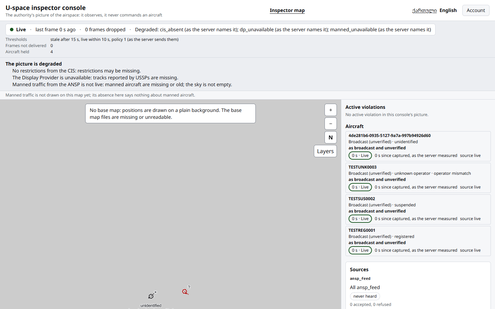
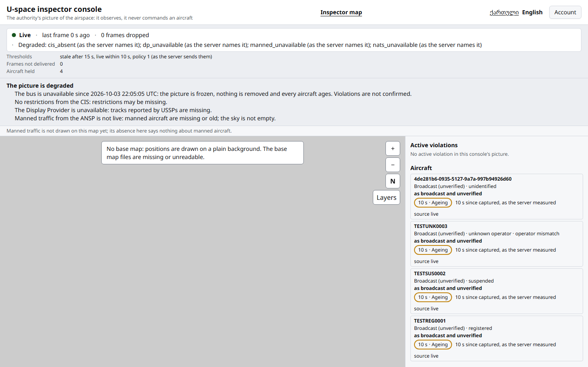

# Runbook: the console (web/)

`web/` is the authority's console (WP-21): Next.js (App Router,
TypeScript strict, `output: "standalone"`) on the shared kit
[`uspace-ui`](https://github.com/rootxkit/uspace-ui), pinned to one
GitHub Release tarball. It renders what `api` and `picture-ws` say and
judges nothing: no database, no NATS, no geometry or geodesy, no JWT
library, no key (CLAUDE.md rule 10). Its only server code is the BFF's
three routes. This WP ships the sign-in, the app shell with the
navigation by role, and the inspector map; WP-22 to WP-24 add pages.

```
web/app/[locale]/login/           the sign-in (password, then the TOTP code)
web/app/[locale]/(signed-in)/     the shell and the inspector map
web/app/%5Fbff/                   the BFF: /_bff/login, /_bff/logout, /_bff/api/*
web/src/lib/bff/handlers.ts       the BFF on the kit's auth/server helpers
web/src/picture/                  the feed, the adapter, the panels, the map
web/src/zones/                    the published zones for the zone layer
web/src/api/generated/            api/openapi.yaml's types (uspace-ui-gen-api)
web/src/picture/generated/        schemas/picture/* and violation/v1 types (json-schema-to-typescript)
web/src/i18n/{ka,en}.json         every display string
web/test/mock-origin.mjs          the Playwright stand-in for Caddy, a stub api and a stub picture-ws
web/scripts/dev-origin.mjs        the local stand-in for Caddy in front of real processes
```

## Local development

Node 22 and pnpm through corepack (`corepack enable`; the version is
`packageManager` in `web/package.json`).

```
cd web
pnpm install --frozen-lockfile
pnpm lint && pnpm typecheck && pnpm test
pnpm build && pnpm check:bundle
pnpm exec playwright install chromium   # once
pnpm e2e                                 # next start behind test/mock-origin.mjs
```

`make web-check` runs the same list from the repository root, and
`make web-image` builds the image (`web/Dockerfile`, context `web/`).

Without a stack, the fixture server is enough to look at the map:
`pnpm build`, then

```
WEB_API_INTERNAL_URL=http://127.0.0.1:3000 WEB_TRUSTED_PROXY_HOPS=1 \
WEB_MFA_CHALLENGE_SECRET=local-only-challenge-seal-key-0123456789 \
WEB_MAP_CENTER=44.80,41.72 WEB_MAP_ZOOM=9 pnpm exec next start --port 3100
MOCK_UPSTREAM=http://127.0.0.1:3100 node test/mock-origin.mjs
```

and open `http://127.0.0.1:3000/en`; the accounts and the code are in
`test/mock-origin.mjs` (test data). `POST /__mock/state
{"nats":"unavailable"}` takes the bus away, `{"revoke":true}` ends every
session.

Against the development stack (`make up`, `uspace-authority migrate`,
then `api` and `picture-ws` from `cmd/`, each with its documented
environment), run `next start` as above with `WEB_API_INTERNAL_URL`
pointing at api, and put `scripts/dev-origin.mjs` in front:

```
DEV_WEB_URL=http://127.0.0.1:3100 DEV_API_URL=http://127.0.0.1:<api port> \
DEV_PICTURE_URL=http://127.0.0.1:<picture-ws port> [DEV_BASEMAP_DIR=<basemap>] \
node scripts/dev-origin.mjs
```

picture-ws must allow the origin `http://127.0.0.1:3000`
(`PICTURE_ALLOWED_ORIGINS`) and api must list the web process as a
trusted proxy (`AUTHORITY_TRUSTED_PROXIES`), or its per-address sign-in
limits apply to the BFF instead of the client.

## Run against the development stack: WP-13's SC-06 picture

Recorded on 2026-10-04 (Windows, Go 1.27.1, Node 22.13, the head of
this branch). This is the "Done when" run: no stub, every process real.

Stack: `deploy/compose.dev.yaml` under its own project name and ports
(`docker compose -p wp21fix-dev`, `AUTHORITY_DEV_*_PORT` 57532, 57533,
57522, 57922), `uspace-authority migrate` (relational 19, timeseries
12). Then `api` (bootstrap admin), `rid-ingest` (EGM2008 grid),
`picture-ws` (`PICTURE_ALLOWED_ORIGINS=http://127.0.0.1:3000`,
`PICTURE_SESSION_URL` and `PICTURE_JWKS_URL` on api), `next start`
(`WEB_API_INTERNAL_URL` on api, `WEB_TRUSTED_PROXY_HOPS=1`), and
`scripts/dev-origin.mjs` on `:3000` in front of all three.
`AUTHORITY_PUBLIC_URL` and `ISSUER_URL` were the origin,
`http://127.0.0.1:3000`. Keys, passwords and TOTP secrets were
throwaway values outside the repository.

SC-06 through api, as WP-13's `TestIntegrationSC06…` sets it up in
process:

1. The admin signs in (password, then TOTP enrolment) and creates
   `registrar1` and `inspector1`.
2. The registrar registers operator `GEOTEST00000001` and the UAS
   `TESTREG0001`, `TESTSUS0002` (then suspended) and `TESTUNK0003`.
3. The admin registers receiver `rx-sc06`.
4. The lab's `cmd/sim-receiver` (uspace-lab 9be1c13) is fed four
   synthetic `sim/vehicle/v1` vehicles on stdin. It broadcasts them as
   signed ODID batches to rid-ingest:

   ```
   --tx 1=AA:BB:CC:00:06:01,TESTREG0001,GEOTEST00000001-x9z
   --tx 2=AA:BB:CC:00:06:02,TESTSUS0002,GEOTEST00000001
   --tx 3=AA:BB:CC:00:06:03,TESTUNK0003,GEOTEST00000099
   --tx 5=AA:BB:CC:00:06:05
   ```

   The first transmitter also broadcasts an EU secret part, `x9z`.

Chromium (Playwright) signed in as `inspector1` through the console's
own form (password, then the TOTP code) and read the page:

```
websocket ws://127.0.0.1:3000/v1/picture/ws
track 4de281b6-…  data-ident=unidentified      "as broadcast and unverified"  0 s · Live  source live
track TESTUNK0003 data-ident=unknown_operator  "as broadcast and unverified"  0 s · Live  source live
track TESTSUS0002 data-ident=suspended         "as broadcast and unverified"  0 s · Live  source live
track TESTREG0001 data-ident=registered        "as broadcast and unverified"  0 s · Live  source live
thresholds  stale after 15 s, live within 10 s, policy 1 (as the server sends them)
dropped     0
banner      CIS absent, Display Provider unavailable, manned traffic not live (true of this stack)
secret part in DOM: false
requests off the origin: []
```



The bus was then taken away (`docker stop` of this stack's NATS):

```
22:05:05.086Z picture-ws  NATS unavailable: the consoles are told and nothing leaves the picture until it is back
22:05:05.630Z banner      The bus is unavailable since 2026-10-03 22:05:05 UTC: the picture is frozen, ...
22:05:05.644Z GET /v1/picture/sources 200 {"nats":"unavailable","nats_since":"2026-10-03T22:05:05.086Z"}
22:05:13.662Z tracks held while the bus is lost: 4 -> 4, each "10 s · Ageing"
22:05:14.444Z NATS started; the nats line left the banner, "The active violations are being read back" came up
```

The banner's time is `nats_since` from `GET /v1/picture/sources`, and
it is the instant in picture-ws's own log line. The four tracks stayed
and aged (E-02). During the outage rid-ingest answered the receiver
503. The receiver kept its batches and its ledger balanced, and after
the bus returned the snapshot held the four statuses again, live.



Notes from the run:

- Headless Chromium has no WebGL by default, and the map then shows the
  lists without symbols. With `--use-angle=swiftshader` the symbols are
  drawn (the first screenshot, lower left). No base map was configured.
- `TESTUNK0003` is `unknown_operator` and also shows "operator
  mismatch": it broadcasts `GEOTEST00000099`, and it is registered
  under `GEOTEST00000001`. The console shows the mismatch flag as
  picture-ws sent it.
- The strip's "Degraded:" line names `cis_absent`, `dp_unavailable` and
  `manned_unavailable` "as the server names it", although the banner
  below says each one in words. The strip is the kit's, and its
  catalogue lacks those slugs.
- Afterwards every process was stopped and the stack removed
  (`docker compose -p wp21fix-dev down -v`).

## Configuration

Read at start or at request time, never at build: the image is built
once in CI and configured by its environment.

| Variable | Meaning |
|---|---|
| `WEB_API_INTERNAL_URL` | api as the web container reaches it; unset, every `/_bff/*` route answers 503 naming it |
| `WEB_MFA_CHALLENGE_SECRET` | seals the MFA challenge between the two sign-in steps (the kit's `mfaChallengeSecret`), at least 32 bytes from the deployment's secret store; unset or shorter, every `/_bff/*` route answers 503 naming it |
| `WEB_TRUSTED_PROXY_HOPS` | reverse proxies in front of Next.js that append to `X-Forwarded-For` (1 behind Caddy); the BFF sends api exactly the address they recorded |
| `WEB_SESSION_MAX_AGE_S` | ceiling of the session cookie's `Max-Age` (43200); api's `expires_at` shortens it |
| `WEB_UPSTREAM_TIMEOUT_MS` | timeout of each BFF call to api (10000) |
| `WEB_MAP_CENTER`, `WEB_MAP_ZOOM` | the inspector map's first view, `"lng,lat"` and a zoom; unset, the map names the variable instead of choosing a place (INV-03) |
| `WEB_BRAND_NAME`, `WEB_BRAND_SHORT_NAME`, `WEB_BRAND_LOGO_URL`, `WEB_BRAND_CONTACT`, `WEB_BRAND_ACCENT` | branding (spec 08 Q15) through the kit's `brandFromEnv`; without them the name is the role ("U-space"); an accent that is not `#rrggbb` fails the page naming the variable |

## The BFF contract

The session contract is `docs/runbooks/session-contract.md`; the BFF is
the kit's `bffHandlers` configured in `web/src/lib/bff/handlers.ts`.

- `POST /_bff/login` `{username, password}` is sent to
  `POST /v1/auth/login`. api answers the MFA challenge; the BFF seals it
  into the `uspace_mfa` cookie (`HttpOnly; Secure; SameSite=Strict;
  Path=/_bff`, as long as the challenge lives) and answers
  `{status: "mfa_required"}` (with the enrolment key while the account
  has none). `POST /_bff/login` `{username, otp}` becomes
  `POST /v1/auth/mfa` `{mfa_token, code}`; on success the session JWT
  goes into `uspace_session` (`HttpOnly; Secure; SameSite=Strict;
  Path=/`, `Max-Age` up to the session's `expires_at`) and a fresh value
  into `uspace_csrf` (readable by the page). The answer never carries
  the token. Sign-in requires a same-origin `Origin`.
- `/_bff/api/<path>` is forwarded to api with the cookie as
  `Authorization: Bearer`, for the paths of `PROXY_ALLOW_PATHS` only:
  `/v1/auth/session` and `/v1/zones` in this WP. Any other path is the
  BFF's 404 and never reaches api; only `GET` is routed. An unsafe
  method (a later WP) needs `X-CSRF-Token` equal to `uspace_csrf`. A 401
  from api clears both cookies.
- `POST /_bff/logout` checks the CSRF pair, tells api
  (`POST /v1/auth/logout`) and clears both cookies whatever api answers.
- The picture WebSocket is not proxied. The page opens
  `/v1/picture/ws` same-origin; the browser sends `uspace_session` on
  the upgrade, and picture-ws checks the `Origin` and the session (M22).
  There is no ticket route and nothing in a query string. A close with
  4401 sends the page to the sign-in.
- The shell decodes the cookie's claims without verification (the kit's
  `sessionClaimsUnverified`: `sub`, `exp`, `roles[]`, `realm`) to arrange
  the navigation (M20). It grants nothing; api and picture-ws decide.

The CSP is the kit's (`web/src/csp.ts`): `connect-src 'self'`,
`font-src 'self'`, `worker-src blob:`, a per-request nonce for scripts
and the kit's styles. The fonts are the kit's Noto Sans and Noto Sans
Georgian through `next/font/local`. The basemap is `/basemap/`, served
by the deployment's Caddy from the shared volume (M38); no request
leaves the origin, which the smoke run asserts.

## The inspector map

The feed is the kit's live client (`useFeed`) on `/v1/picture/ws`: it
subscribes with `console/subscribe/v1 {bbox, layers: [tracks, alerts,
zones]}` from the viewport (padded by a quarter, widened to 0.1°, sent
300 ms after the map settles; the initial view at once, also without
WebGL), applies status frames and snapshots itself, and hands every
other frame to `web/src/picture/adapt.ts`.

- Tracks show their trust class, identification status (a mismatch is
  never shown as registered), "as broadcast and unverified" for every
  broadcast track and "as reported by a provider and unverified" for
  every provider track (R-05), the age since this console received the
  position (bucketed by the frame's `stale_after_s`), picture-ws's age
  since capture, and the source's state. A held track is never hidden
  for its age; under `nats_unavailable` the picture is frozen and ages.
- The thresholds are the status frame's `stale_after_s` and
  `live_max_age_s`; until one arrives no age is bucketed and the strip
  says so. `dropped_frames` is on the strip.
- `degraded[]` is a banner, one line per slug in words
  (`web/src/picture/degraded.ts`), with the server's ages
  (`projection_age_s`, `cis_age_s`) and, for the bus, picture-ws's
  `nats_since` read from `GET /v1/picture/sources`. An unknown slug is
  shown as the server names it.
- The violations panel is the snapshot's `alerts[]` on connect (C-08),
  then every raise, update and clear.
- The sources panel is the kit's, from the status frame's `sources[]`:
  enabled, disabled by whom, stale, lagging, never heard.
- The zone layer is `GET /v1/zones?state=published` through the BFF. A
  circle is listed as not drawn (drawing one is geodesy); a role api
  refuses the zones to is told so, never shown an empty map.
- What the console refuses or does not draw is counted on the strip
  ("Not shown"), never dropped silently. Manned traffic is not drawn
  in this WP, and the page says so.

What the console never keeps: the `operator_position` a Display
Provider track carries is dropped by the adapter before anything is
stored, and a registration number is shown through the kit's formatter,
which keeps an EU secret part off the screen (picture-ws sends only the
public part; G-04).

## Generated types

- API: `pnpm gen:api` runs the kit's `uspace-ui-gen-api` on
  `../api/openapi.yaml` into `web/src/api/generated/openapi.d.ts`, whose
  first line records the input's SHA-256. `pnpm check:api` fails on a
  stale file.
- Frames: `pnpm gen:schemas` (`web/scripts/gen-schemas.mjs`) generates
  this repository's frame extras (`schemas/picture/status`, `track`,
  `snapshot` and `schemas/violation/v1.json`) into
  `web/src/picture/generated/` with `json-schema-to-typescript`, from
  each schema's `$defs.body` alone, so nothing is fetched. `pnpm
  check:schemas` fails on a stale file; CI shows it does.
- The lab's shared shapes (`console/*`, `track/telemetry/v1`) are the
  kit's to parse; the tests and the smoke run read the lab's examples
  from `internal/picture/testdata/lab/` (copies at the commit in its
  `SOURCE`).

Commit the regenerated files with the change that caused them.

## The catalogue rules

- Every display string is a key in `web/src/i18n/en.json` and `ka.json`
  (or a kit key); both hold the same keys with the same placeholders
  (`src/i18n/catalogue.test.ts`). A JSX text node or a literal
  `aria-label`, `title`, `alt`, `placeholder` or `label` fails lint
  (`authority/no-jsx-literals`).
- Words never claim a loss that has not happened (C-12): "unavailable",
  "stale" and "lagging" say what the server says, and an empty list
  says to check the feed, the degraded states and the sources before
  reading it as an empty sky (E-02).
- Times are shown in UTC with the kit's `fmtTimeUTC`, ages with
  `fmtAge`, altitudes with their datum (`fmtAltitude`), never bare
  metres.

## CI

The job `web` runs on a change to `web/**`, `api/openapi.yaml`,
`schemas/picture/**`, `schemas/violation/**` or the lab examples, and on
every push to main: frozen install, both generated-type checks (and a
stale file shown to fail), lint, the backstops of the restricted
imports (`scripts/check-lockfile.mjs`: every package `pnpm-lock.yaml`
installs, transitive ones included, against the lint rule's own list in
`eslint-rules/restricted.mjs`; and a grep for the imports in `app/` and
`src/`; each shown to find its fixture), types, vitest, the build, the bundle check (no database, NATS or key variable named in
the server bundle), the Playwright smoke (zero passed, a skip or a
flaky test fails the job), and the image build. On main and tags the
`image` job pushes and signs `ghcr.io/rootxkit/uspace-authority-web`.
